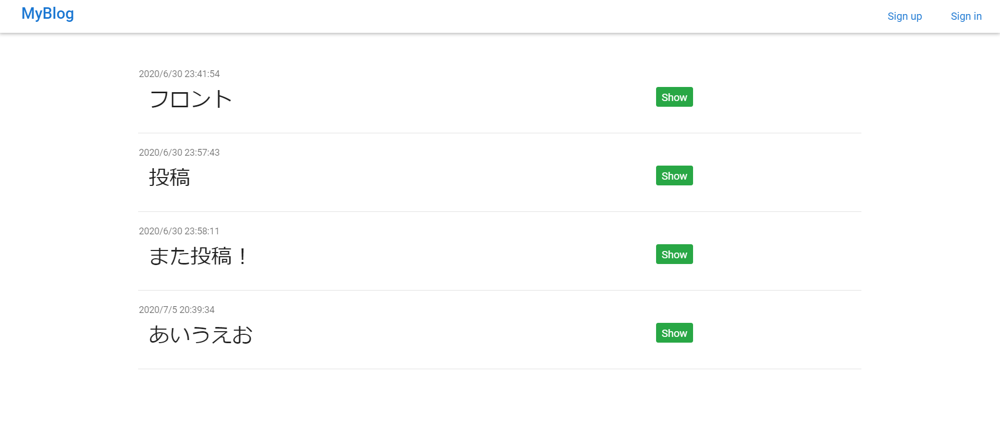
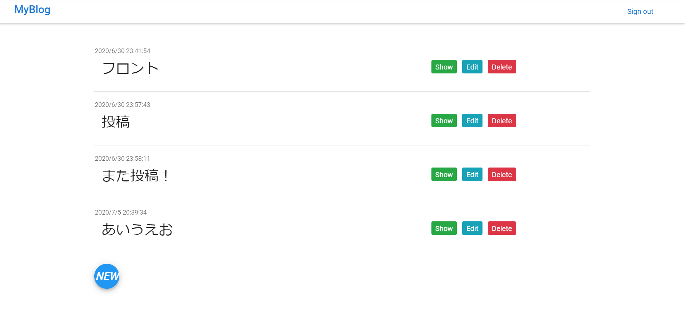

# MyBlog
I create a blog system in JavaScript(Node.js).

Using vue.js, vuerify, firebase(database, hosting, authentication).


### Create that:

* Respond with all blog pages
* Respond with data for a blog page
* Handle creation of a blog page
* Handle editing of a blog page
* Handle deletion of a blog page

### Store data
* Use Firebase Database

### Authentication for my blog system
* Use firebase Authentication
* email + password

### Unit test
* Use Jest
* Still being worked on...;

## Deploy
[here](https://my-blog-7c08b.web.app/) (firebase hosting)


## Demo
#### Post


#### Edit


#### Delete


## Authentication
Change the display depending on whether you are logged in or not.

<b>Not logged in...</b>



<b>Logged in...</b>




## Project setup
```
npm install
```

### Compiles and hot-reloads for development
```
npm run serve
```

### Compiles and minifies for production
```
npm run build
```

### Lints and fixes files
```
npm run lint
```

### Customize configuration
See [Configuration Reference](https://cli.vuejs.org/config/).
